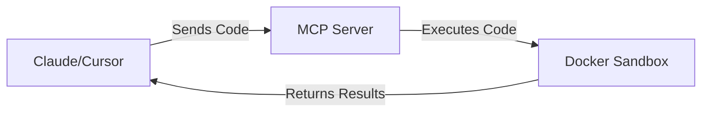

# MCP Docker Sandbox Interpreter

A secure Docker-based code execution environment for the Model Context Protocol (MCP).

## Overview

This project provides a secure sandbox for executing code through MCP (Model Context Protocol). It allows AI assistants to safely run code without requiring direct access to the host system, by executing all code within isolated Docker containers.



## Features

- **Secure Execution**: Code runs in isolated Docker containers with strict security limitations
- **Multi-Language Support**: Currently supports Python with easy extensibility for other languages
- **Resource Limitations**: CPU and memory restrictions to prevent abuse
- **MCP Integration**: Fully compatible with the Model Context Protocol
- **Automatic Setup**: Handles container creation, dependency installation, and cleanup

## Requirements

- Docker (Desktop or Engine)
- Python 3.10+
- MCP SDK (`pip install mcp`)
- Docker Python SDK (`pip install docker`)

## Installation

1. Clone this repository:
   ```bash
   git clone https://github.com/yourusername/mcp-docker-interpreter.git
   cd mcp-docker-interpreter
   ```

2. Create and activate a virtual environment:
   ```bash
   python -m venv .venv
   source .venv/bin/activate  # On Windows: .venv\Scripts\activate
   ```

3. Install dependencies:
   ```bash
   pip install -r requirements.txt
   ```

## Usage

### Starting the MCP Server

Start the server by running:

```bash
# For Colima users:
export DOCKER_HOST="unix:///Users/username/.colima/default/docker.sock"

# Run the server
uv run mcp dev main.py
```

### Connecting to an AI Assistant

You can connect this MCP server to AI assistants that support the Model Context Protocol:

#### Cursor

In Cursor, add the following to your MCP settings:

```json
{
  "mcpServers": {
    "docker-sandbox": {
      "command": "python",
      "args": ["/absolute/path/to/your/main.py"],
      "env": {
        "DOCKER_HOST": "unix:///path/to/your/docker.sock"
      }
    }
  }
}
```

Replace the paths with your actual file paths.

#### Claude Desktop

Similar to Cursor, add the configuration to Claude Desktop's MCP settings.

### MCP Tools

This MCP server exposes three main tools:

1. **initialize_sandbox**: Creates a new Docker container for code execution
   ```
   Arguments:
   - image: The Docker image to use (default: "alpine:latest")
   ```

2. **execute_code**: Runs code in the initialized sandbox
   ```
   Arguments:
   - code: The code string to execute
   - language: Programming language (default: "python")
   ```

3. **stop_sandbox**: Stops and removes the container
   ```
   No arguments needed
   ```

## How It Works

1. When `initialize_sandbox` is called, the system:
   - Creates a Docker container based on Alpine Linux
   - Installs Python and other dependencies
   - Sets up security restrictions

2. When `execute_code` is called:
   - Code is executed within the isolated container
   - Standard output and errors are captured
   - Results are returned to the calling application

3. When `stop_sandbox` is called:
   - The container is stopped and removed
   - All resources are released

## Security Considerations

This sandbox implements several security measures:

- Containers have restricted CPU and memory usage
- Containers are run with minimal privileges
- Network access is disabled by default
- Containers are disposable and cleaned up after use

## Development

### Project Structure

```
mcp-docker-interpreter/
├── main.py          # Main implementation of MCP server and Docker sandbox
├── requirements.txt # Project dependencies
└── README.md        # This file
```

### Adding New Language Support

To add support for a new programming language, modify the `run_code` method in the `DockerSandbox` class to handle the new language.

## Troubleshooting

### Common Issues

1. **Docker connection error**:
   - Ensure Docker is running
   - Check that the DOCKER_HOST environment variable is correctly set for your Docker installation

2. **Container creation fails**:
   - Verify you have permission to create Docker containers
   - Ensure the specified base image is accessible

3. **Code execution fails**:
   - Check that the language runtime is properly installed in the container
   - Verify the code is valid for the specified language

## License

[MIT License](LICENSE)

## Acknowledgements

- This project uses the [Model Context Protocol](https://modelcontextprotocol.io/)
- Built with [Docker SDK for Python](https://docker-py.readthedocs.io/)
